<br><br>

<!-- project philosophy -->


> A mobile app for connecting lovers together and assisting them through a fun and harmonious relationship.
>
> Bound Harmony first requires the users, who probably are in a relationship, to connect their accounts and fill a survey. To make their relationship smoother, Bound Harmony will provide the couple with date suggestions and bonding activities. To make it even better, our cupid will be ready to give advice at any time!

### User Stories
- As a user, I want recommendations for fun and romantic date night ideas to keep our relationship exciting.
- As a user, I'd like suggestions for weekend getaways that align me and my partner's shared interests, creating memorable experiences for both of us.
- As a user, I want personalized advice to enhance both my personal journey and my relationship.

### Admin Stories
- As an admin, I want to monitor users' behavior within the application to understand their preferences and interests.
- As an admin, I want to be able to manage user accounts by deleting or restoring accounts.
- As an admin, I want to see the most common responses to my surveys, so that I can use this data to enhance my app.
<br><br>

<!-- Tech stack -->


###  The following are the technologies I used to build Bound Harmony:

- This project uses the [Flutter app development framework](https://flutter.dev/). Flutter is a cross-platform hybrid app development platform which allows us to use a single codebase for apps on mobile, desktop, and the web.
  <br><br>
- The admin panel is done using [React.js](https://react.dev/). React.js is a JavaScript library for building single-page applications out of individual pieces called components.
<br><br>
- The backend is handled using [Laravel](https://laravel.com/). Laravel is a PHP web application framework that follows the Model-View-Controller (MVC) architectural pattern. With features like Eloquent ORM and artisan command-line tools, Laravel facilitates development and supports modern, feature-rich web applications.
<br><br>
- For managing the database schemas and establishing relational connections between tables, I used [MySQL](https://www.mysql.com/), a relational database management system. MySQL ensures efficient data storage and retrieval, complementing Laravel's capabilities for seamless and reliable web application development.
<br><br>
- In the Advice section, I integrated [openAi](https://platform.openai.com/docs/introduction). In order to make the advice personalized, survey responses are handled in the backend and are summarized before being sent to the api, you can read more about prompt handling in the Prompt Engineering section. I also used [Laravel's OpenAi Library](https://github.com/openai-php/laravel), which is open source and helps with handling the openAi api.
<br><br>
- In the Suggestions section, I used Google's [Google Places Api](https://developers.google.com/maps/documentation/places/web-service/search-nearby) nearby-search. The Google Places Api has a database with over 200 million places, categorized into types and sections. So, I took advantage of this categorization, in correlation with the user's survey responses, to get the places that best suites each user.   
<br><br>
- The app uses the font ["Nunito"](https://fonts.google.com/specimen/Work+Sans) as its main font, and the design of the app adheres to the material design guidelines.

<br><br>

<!-- UI UX -->

> I designed Bound Harmony using wireframes and mockups, iterating on the design until I reached the ideal layout for easy navigation and a seamless user experience.
<br><br>

| OnBoarding Screen | Login screen  | Register screen | Setup screen |
| ---| ---| ---| ---|
|  |  |  | 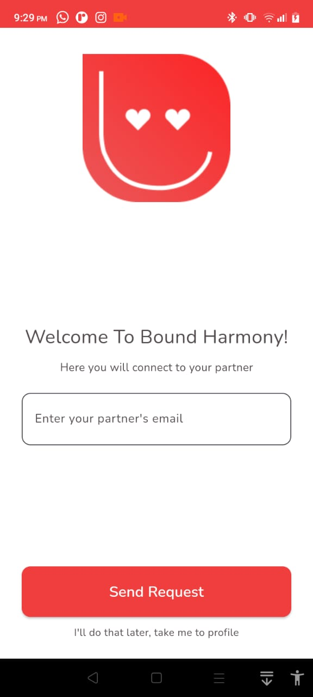 |
| Successful Setup screen | Suggestion screen (Landing) | Date Builder Screen |  Bonding Activities Screen |
|  | 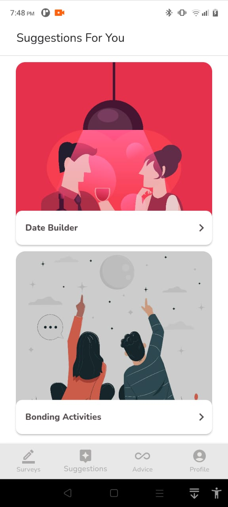 | 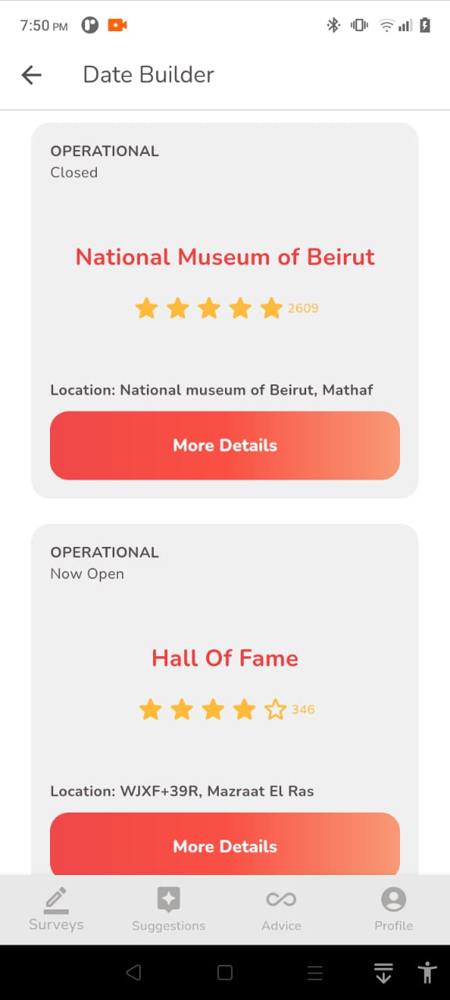 | 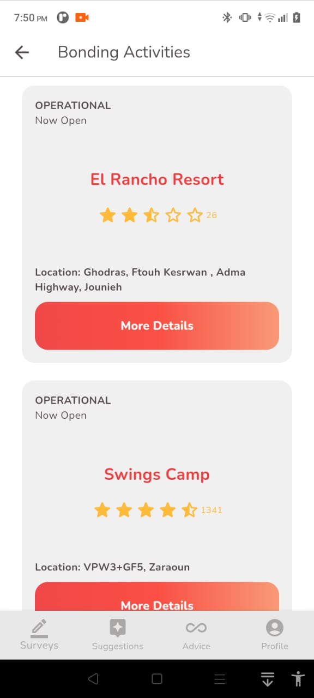 |
| Suggestions Screen alert 1 | Suggestions Screen alert 2 | Surveys Screen | Personal Survey Screen | 
| 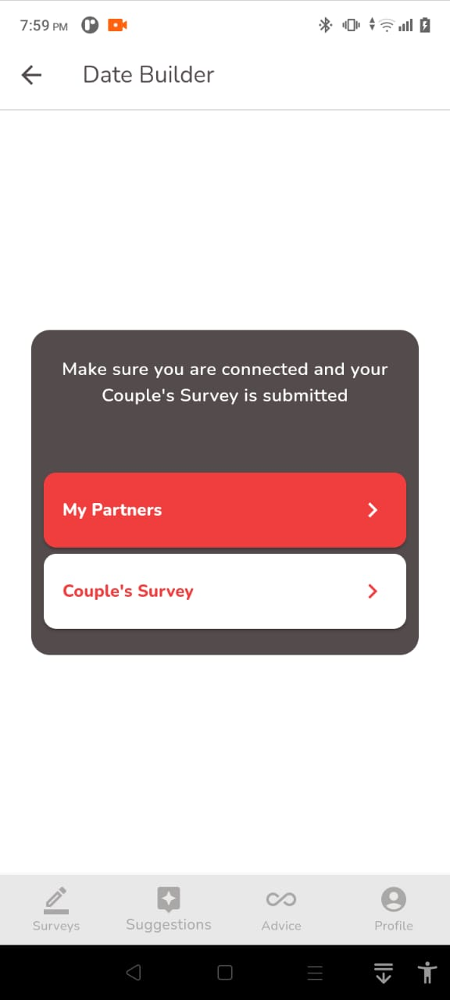 | 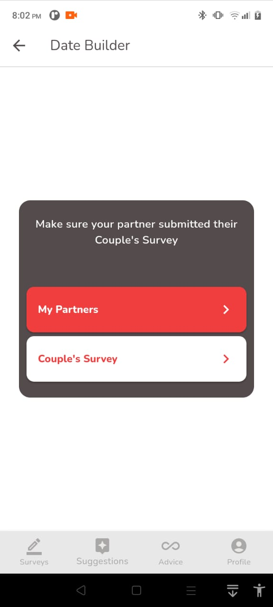 |  |  |
| Couples Survey Screen | Personal Survey complete | Couples Survey complete | Advice screen |
| 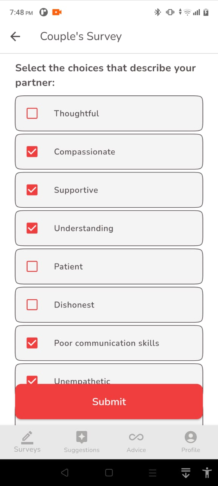 |  |  |  |
| Profile screen | Incoming Requests alert 1 | Incoming Requests screen | Suggestions Screen alert 2 |
| 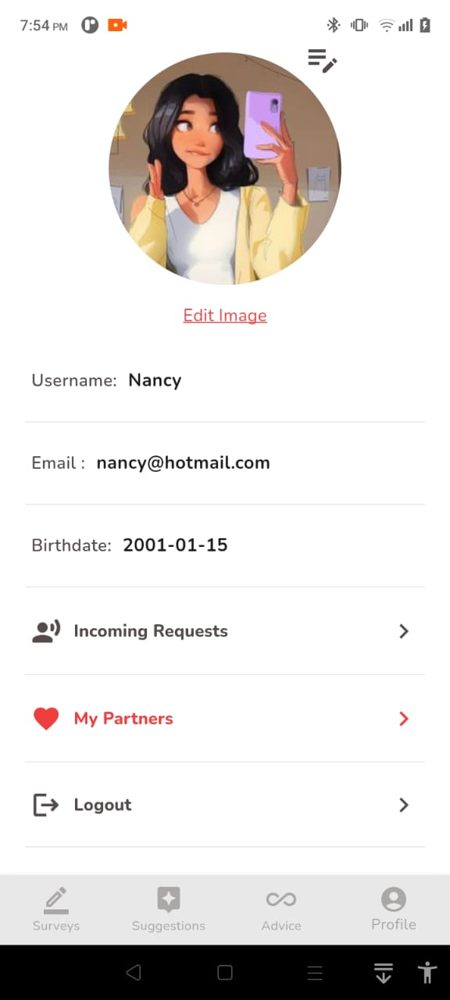 | 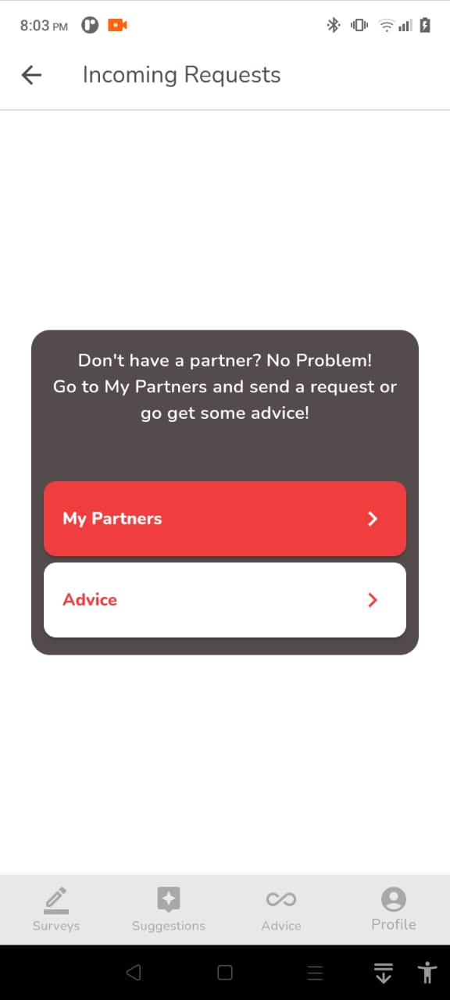 |  |  |
| My Partners screen (single) | My Partners (in a relationship) | My Partners (single + no history) |
| 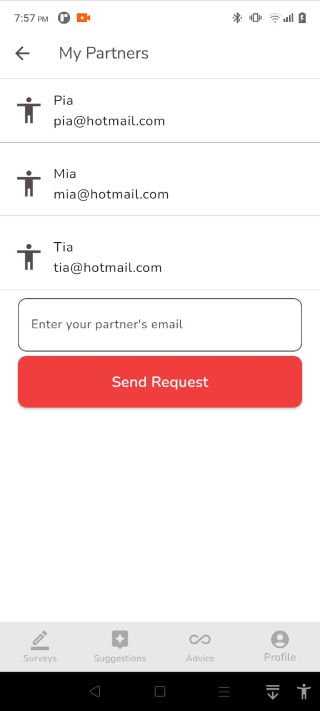 | 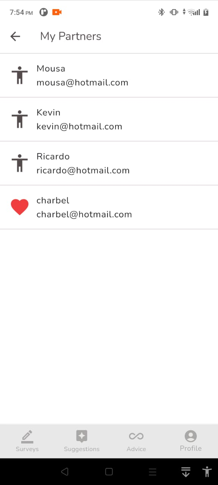 | 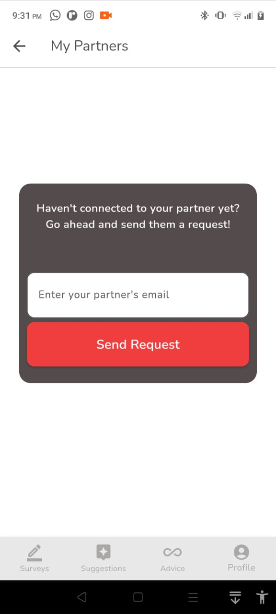 |

<br><br>

<!-- Implementation -->

<br><br>
> Using the wireframes and mockups as a guide, I implemented the Bound Harmony app with it's features. Here is an overview of what the user will have in the app:

### User Screens (Mobile)
| Sign Up | Login-Setup | Profile Customization | 
| --- | --- | --- |
|  |  | 
| Incoming Requests | Personal Survey | Couple's Survey |
|  |  |  | 
| Date Suggestions | Bonding Activities Suggestions | Personalized Advice |
|  |  |  |
| Disconnect from Partner |
|  |

> To keep track of all the inputs coming into the app, the admin page displays a summary of the users' behavior and their responses to each survey. 

### Admin Screens (Web)
| Login screen  | Dashboard Screen |
| ---| ---|
|  |  | 
| Users Screen | Survey Responses |
| 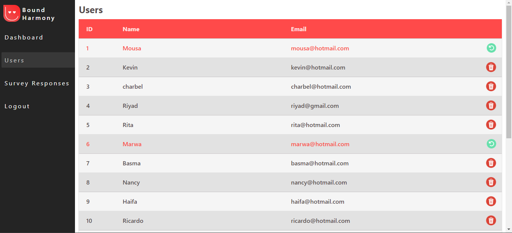 |  |
<br><br>

<!-- How to run -->


> To set up Bound Harmony locally, follow these steps:

### Prerequisites

* npm
  ```sh
  npm install npm@latest -g
  ```

### Installation

1. Clone the repo
   ```sh
   git clone https://github.com/MarcDagher/Bound-Harmony.git
   ```
2. Install [Composer](https://getcomposer.org/)
   ```sh
   composer install
   ```
3. Rename your '.env.example' file to '.env'
<br><br>
4. Open your new .env file and make the necessary changes (App name, app key, database name...)
<br><br>
5. Generate an application key:
   ```sh
   php artisan key:generate
   ```
6. Get Migrations
   ```sh
   php artisan migrate
   ```
7. Seed Database
   ```sh
   php artisan db:seed
   ```
8. Install NPM packages
   ```sh
   npm install
   ```
9. Install [Flutter SDK](https://docs.flutter.dev/get-started/install)
<br><br>
10. Go to flutter_app directory
     ```sh
     cd flutter_app
     ```
11. Install pub packages
     ```sh
     flutter pub get
     ```
12. Run flutter_app 
     ```sh
     flutter run
     ```

Now, you should be able to run Bound Harmony locally and explore its features :) :rocket:
