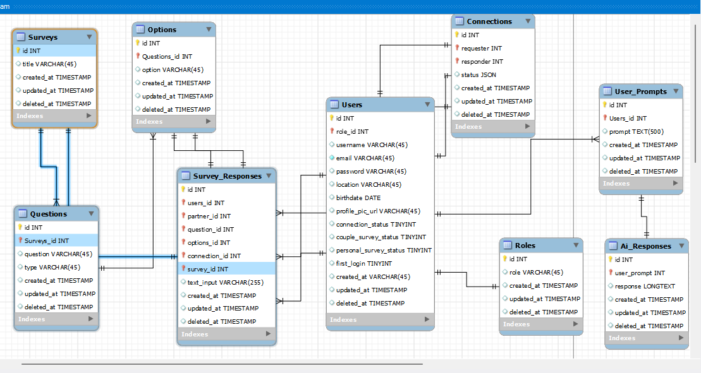
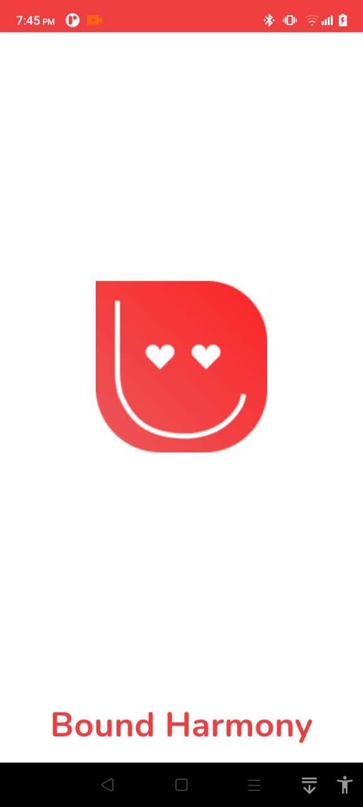
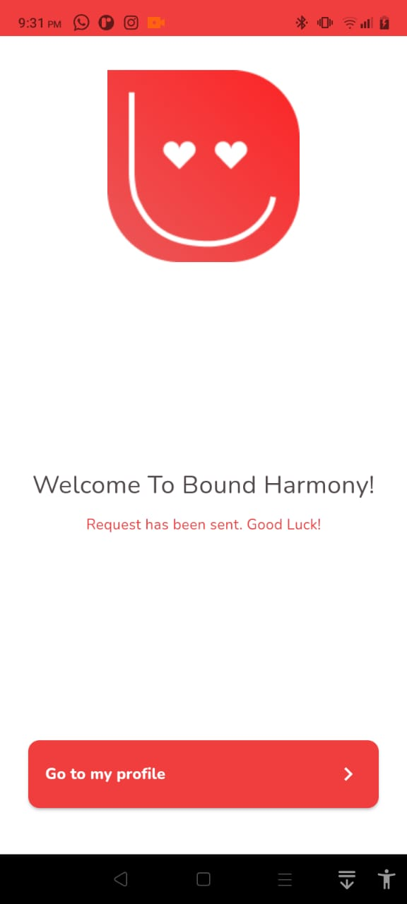
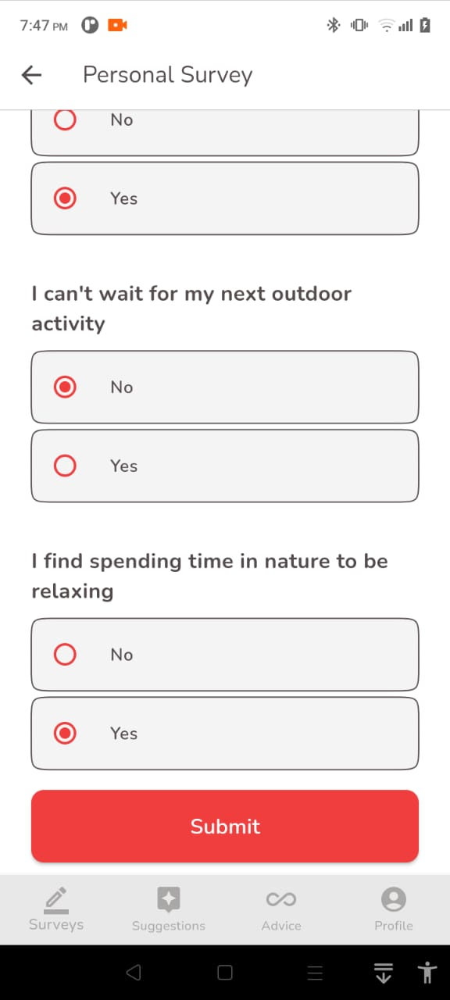
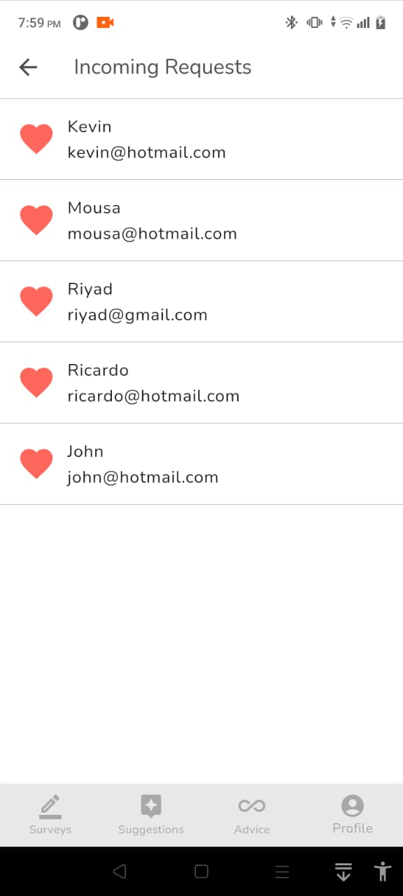
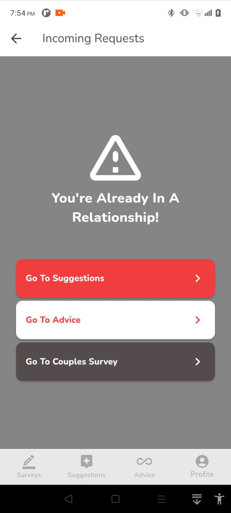
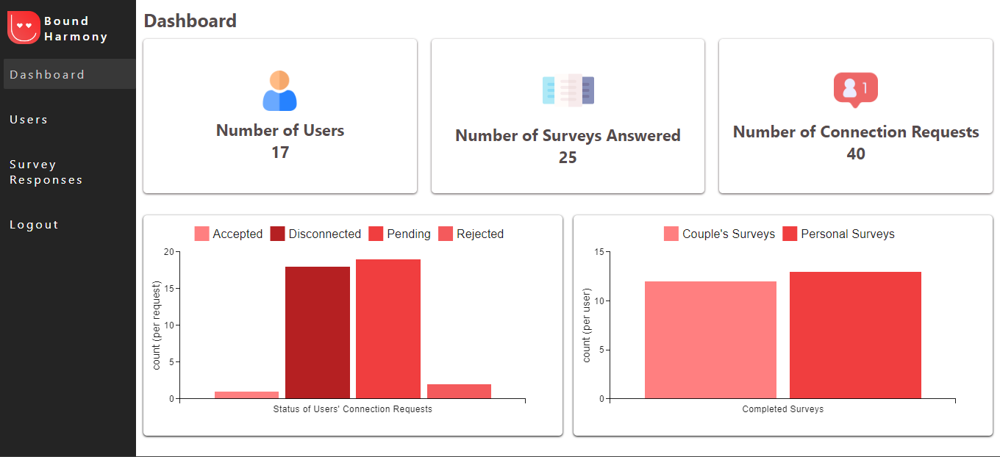

<br><br>

<!-- project philosophy -->


> A mobile app for connecting lovers together and assisting them through a fun and harmonious relationship.
>
> Bound Harmony first requires the users, who probably are in a relationship, to connect their accounts and fill a survey. To make their relationship smoother, Bound Harmony will provide the couple with date suggestions and bonding activities. To make it even better, our cupid will be ready to give advice at any time!

### User Stories
- As a user, I want recommendations for fun and romantic date night ideas to keep our relationship exciting.
- As a user, I'd like suggestions for weekend getaways that align me and my partner's shared interests, creating memorable experiences for both of us.
- As a user, I want personalized advice to enhance both my personal journey and my relationship.

### Admin Stories
- As an admin, I want to monitor users' behavior within the application to understand their preferences and interests.
- As an admin, I want to be able to manage user accounts by deleting or restoring accounts.
- As an admin, I want to see the most common responses to my surveys, so that I can use this data to enhance my app.
<br><br>

<!-- Tech stack -->


###  The following are the technologies I used to build Bound Harmony:

- This project uses the [Flutter app development framework](https://flutter.dev/). Flutter is a cross-platform hybrid app development platform which allows us to use a single codebase for apps on mobile, desktop, and the web. As for managing the state of the app, I used Provider.
  <br><br>
- The admin panel is done using [React.js](https://react.dev/). React.js is a JavaScript library for building single-page applications out of individual pieces called components.
<br><br>
- The backend is handled using [Laravel](https://laravel.com/). Laravel is a PHP web application framework that follows the Model-View-Controller (MVC) architectural pattern. With features like Eloquent ORM and artisan command-line tools, Laravel facilitates development and supports modern, feature-rich web applications.
<br><br>
- For managing the database schemas and establishing relational connections between tables, I used [MySQL](https://www.mysql.com/), a relational database management system. MySQL ensures efficient data storage and retrieval, complementing Laravel's capabilities for seamless and reliable web application development.
<br><br>
- In the Advice section, I integrated [openAi](https://platform.openai.com/docs/introduction). In order to make the advice personalized, survey responses are handled in the backend and are summarized before being sent to the api, you can read more about prompt handling in the Prompt Engineering section. I also used [Laravel's OpenAi Library](https://github.com/openai-php/laravel), which is open source and helps with handling the openAi api.
<br><br>
- In the Suggestions section, I used Google's [Google Places Api](https://developers.google.com/maps/documentation/places/web-service/search-nearby) nearby-search. The Google Places Api has a database with over 200 million places, categorized into types and sections. So, I took advantage of this categorization, in correlation with the user's survey responses, to dynamically get the places that best suites each user.   
<br><br>
- The app uses the font ["Nunito"](https://fonts.google.com/specimen/Work+Sans) as its main font, and the design of the app adheres to the material design guidelines.
<br><br>

### Mockups
<!-- UI UX -->


> I designed Bound Harmony using wireframes and mockups, iterating on the design until I reached the ideal layout for easy navigation and a seamless user experience.
>
> Project Figma design [figma](https://www.figma.com/file/TSZRJHG6RUwk7BSmmw0xqp/Final-Project-WireFrame?type=design&node-id=20-6&mode=design&t=tO7JOSC5rfTelpo4-0)
<br><br>

| Survey Screen | Suggestions screen | Advice Screen | 
| ---| ---| ---|
|  |  |  | 

<br><br>

<!-- Database Design -->


### Innovative Database Design Strategies:



<br><br>

<!-- Implementation -->


### User Screens (Mobile)

| OnBoarding Screen | Register screen | Setup screen | Succesful Setup screen  |
| ---| ---| ---| ---|
|  |  |  |  |
| Surveys screen | Suggestion screen (Landing) | Advice Screen |  Profile Screen |
|  |  |  |  |
| Inside Surveys | Inside Suggestions | Incoming Requests screen | My Partners screen | 
|  |  |  |  |
| Survey Complete | User Not Connected | Survey Not Complete | User Already Connected |
|  |  | | 


### Demo

| Login-Setup | Incoming Requests | Couple's Survey |
| --- | --- | --- |
| |  |  | 
| Date Suggestions | Personalized Advice | Disconnect from Partner |
|  |  |  |

### Admin Screens (Web)

> To keep track of all incoming inputs, the admin page displays a summary of the users' behavior and the total number of times each survey response option was chosen. 

| Login screen  | Dashboard Screen |
| ---| ---|
|  |  | 
| Users Screen | Survey Responses |
|  |  |

<br><br>

<!-- Prompt Engineering -->


###  OpenAi Prompt Configuration:

To make the user's experience in the application more pleasant and entertaining, I used the data inputted from the surveys to make the responses personalized. Since the surveys are about interests, I created helper functions to summarize and label the user's interests. Then, I added the result into the AI's system prompt. 
The system prompt is divided into 6 parts: 
- Description: Describes the identity of the AI.
- Purpose: Describes the goal of the AI and its functionality.
- Tone Of Speech: Describes the choice of words and their semantics.
- End Statements: Describes how the AI will finish it's response.
- Removals: Specifies what to remove from the response.
- Our Interests or My Interests: Depending on whether the user is single or not, this final part is a list of keywords, derived by the summary of the user's survey responses, which is added to make sure the AI knows who the user is and what the user might want.

Here is a screenshot of the base descriptions:


Depending on the user's conditions, the prompt will slightly differ. This is what the final prompt of a user who's connected to a partner will look like:


  
<br><br>

<!-- Machine Learning -->


Since the theme of the app revolves around interests and relationships, I conducted a survey that received responses from 132 participants. The survey primarily targeted individual interests and perspectives on the respondents' relationships.

Machine learning, a subset of AI, involves developing models that enable computers to learn from data, make predictions, and enhance performance on specific tasks without explicit programming. To train the model, I followed these steps:

- Cleaned, renamed, and reorganized the survey data using Pandas and NumPy. Pandas and NumPy are Python libraries employed for data manipulation and analysis, providing data structures like DataFrames and supporting large, multi-dimensional arrays.
- Visualized, assessed data cleanliness, and analyzed patterns with potential logical correlations. For this task, I utilized Weka, a versatile and user-friendly visual data mining and machine learning software. The image below displays the cleaned data before feeding it into the model for training.


Before moving on to data testing, it's noteworthy that the dataset shows nearly equal distribution, with 50% of respondents falling on each side of the data spectrum, making it a relatively balanced dataset.
- To assess the data's capabilities, a classification approach is adopted. Classification involves specifying the label to be predicted, and in our case, the label is "in_a_relationship." This label represents the likelihood that a user, based on their set of interests, is in a relationship.
- The model is then automatically trained on Weka using cross-validation. Cross-validation is a training technique which repeats a set of attributes multiple times and in a randomized way, in order to make the model's learning more diverse.
The following results are from the trained model on Weka:


We observe that the model accurately predicts the correct answer 58% of the time, but also shows errors 45% of the time. The model's training implementation involved Pandas, NumPy, and Sklearn. A DecisionTree technique was used, enabling the model to navigate its path to the correct answer by making one choice at a time. The process of training involved the following steps:
- Refactoring the data's CSV file.
- Selecting the classification label.
- Dividing the dataset into a training set and a testing set.
- Applying Sklearn methods to split and learn from the data using DecisionTreeClassifier.
- Training the model using cross-validation, where the training set and the testing set were shuffled 10 times to enhance the model's learning diversity.
- Using the DecisionTree algorithm to make the model come up with the predictions.
- Plotting the result and exporting it as a graph.
- The following image is a graph which represents the DecisionTree the model used to come up with the correct prediction.


<!-- AWS Deployment -->


###  Take Advantage of AWS' Integration:

While developing Bound Harmony's Laravel server locally, I chose to enhance accessibility by hosting the APIs on AWS, making them publicly available. AWS is a cloud computing platform provided by Amazon that offers a diverse range of scalable cloud services. The process of deployment included:
- Creating and configuring an instance.
- Installing Apache, MariaDb, and PHP.
- Creating a Database and a User.
- Installing Composer and Git.
- Cloning my Laravel server from my Github repo and downloading Laravel.
- Granting user all access and change laravel's permission files.
- Creating Laravel's environment (.env, generate key, change DB name, username, and password)
- Creating an Apache configuration file that will point the server to serve the files provided by Laravel instead of the default Apache page.
  
<br><br>

<!-- Unit Testing -->


###  Precision in Development:

- The number one reason for chaos and errors during development is insufficient testing. For this reason, Unit Testing has proven to be one of the best ways to address this issue. By adopting the AAA (Arrange - Act - Assert) approach, Unit Testing effectively minimizes the chances of encountering errors in our projects during development or after production. 
The following screenchot illustrates a snippet of the test results implemented in my application.


<br><br>

<!-- How to run -->


> To set up Bound Harmony locally, follow these steps:

Clone the repo
   
   ```sh
   git clone https://github.com/MarcDagher/Bound-Harmony.git
   ```
### To Run the Admin Web App

Install npm packages
 
  ```sh
  npm install
  ```

### To Start the Laravel Server on LocalHost

1. Install [Composer](https://getcomposer.org/)
 
   ```sh
   composer install
   ```
2. Rename your '.env.example' file to '.env'
<br><br>
3. Open your new .env file and make the necessary changes (App name, app key, database name...)
<br><br>
4. Generate an application key:

   ```sh
   php artisan key:generate
   ```

5. Inside your .env file add OPENAI_API_KEY and a GOOGLE_PLACES_API_KEY and insert your Keys.<br><br>Note: Advice Screen and Suggestions Screen need these 2 keys.

6. Get Migrations

   ```sh
   php artisan migrate
   ```
7. Seed Database: You can go to database/seeders/DatabaseSeeder and uncomment the lines you want to seed in the order they are written. 

   ```sh
   php artisan db:seed
   ```
## To Run the Flutter App

1. Install [Flutter SDK](https://docs.flutter.dev/get-started/install)
<br><br>
2. Go to flutter_app directory

     ```sh
     cd flutter_app
     ```
4. Install pub packages

     ```sh
     flutter pub get
     ```
5. Run flutter_app

     ```sh
     flutter run
     ```
Note: Inside your Flutter app, make sure your BaseUrl inside lib/configurations/request.configuration.dart is set to your current local host server.

Now, you should be able to run Bound Harmony locally and explore its features :) :rocket:
